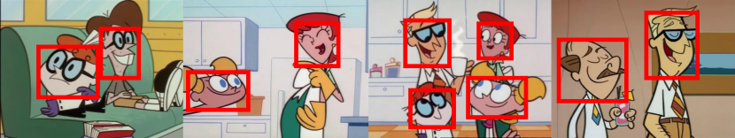
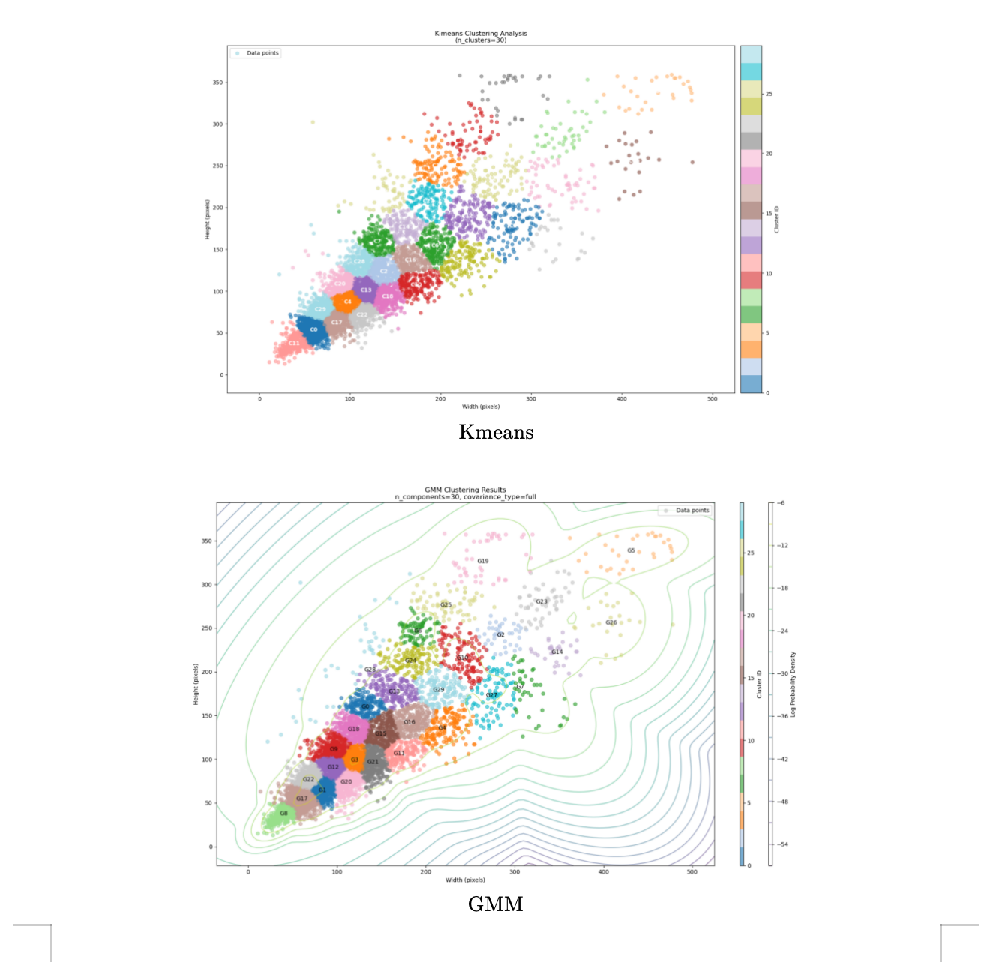
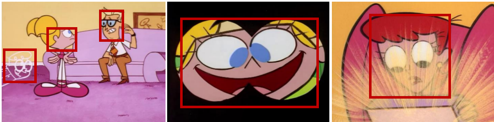
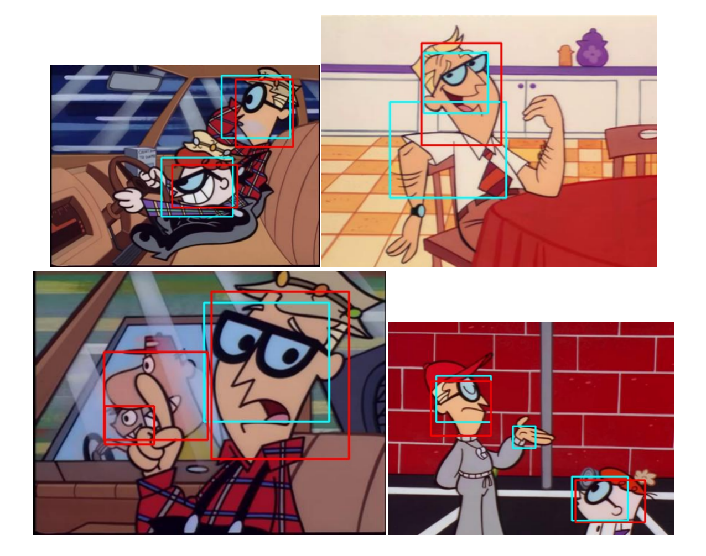
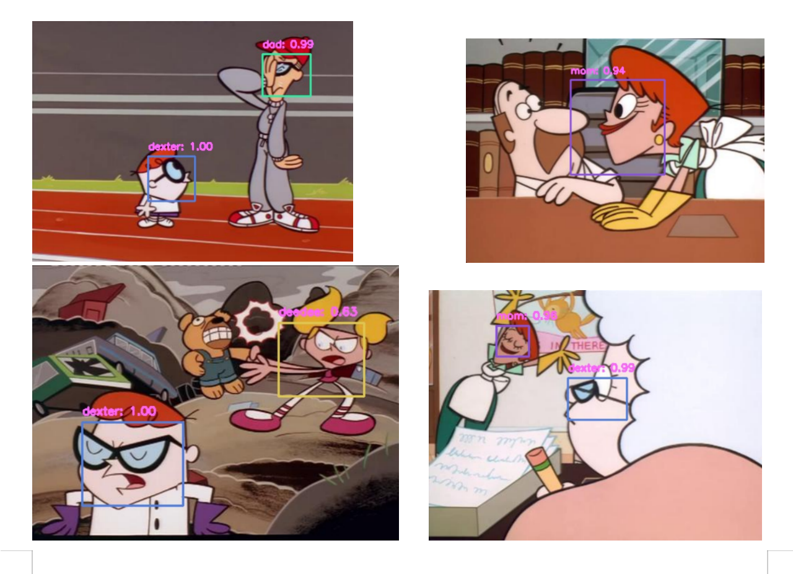
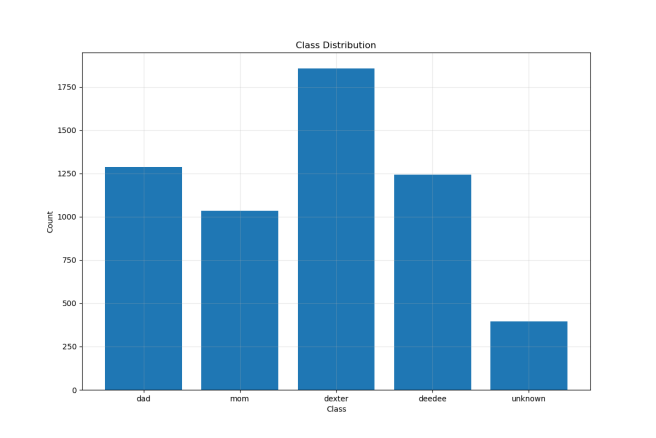
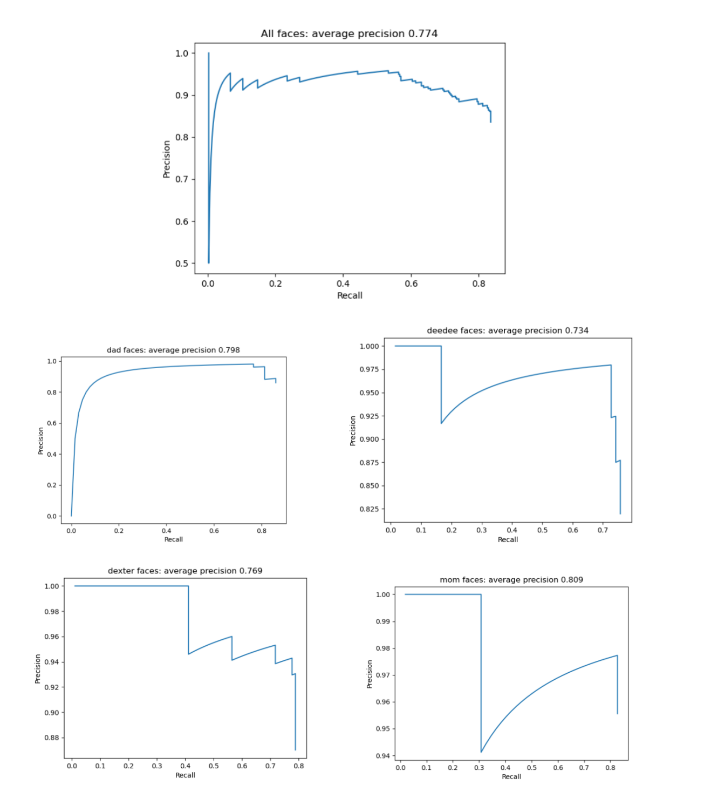

<h1>Dexter Laboratory - Face Detection & Recognition</h1>

<h2>A computer vision approach for detecting and recognizing cartoon characters</h2>



<br>
<hr>
<h2>About it</h2>

<p>The current application purpose is to achieve high performance in facial detection and recognition on an images dataset based on Dexter's Laboratory cartoon.</p>

<p>The problem involves detecting cartoon character faces in images and recognizing which character each belongs to. Cartoon faces present unique challenges due to artistic variations, exaggerated features, and diverse poses.</p>

<p>The code purpose is to solve the following main tasks:</p>
<ol>
    <li>Detect all faces using sliding window technique with binary classification</li>
    <li>Aggregate duplicate detections and filter false positives</li>
    <li>Classify detected faces into character categories (Dad, Mom, Dexter, Deedee, Unknown)</li>
</ol>

<p>The implementation follows strict constraints: no pre-trained models or transfer learning allowed.</p>

<p>The final model achieves <strong>0.774 average precision</strong> for face detection and <strong>0.777 mAP</strong> for character recognition.</p>

<br>
<hr>
<h2>How to use it</h2>

> **NOTE**: For this you will need to have <code>conda</code> installed. If you do not have it, you can install it by following the instructions from the <a href="https://docs.conda.io/projects/conda/en/latest/user-guide/install/index.html">official documentation</a>.

<p>For using the provided application you will need to install the dependencies by running the following code:</p>

```bash
conda create -n dexter python=3.10
conda activate dexter
conda install matplotlib numpy opencv scipy tqdm -y
pip install tf_keras
```

<p>For creating a Python virtual environment you can use the following <a href="https://www.freecodecamp.org/news/how-to-setup-virtual-environments-in-python/">guide</a>. Then install the dependencies using <code>pip</code>.</p>

<p>This will create a new environment called <code>dexter</code> and install the required packages, using <code>Python3</code>.</p>

<p>After that we will want to install the <code>Tensorflow</code> package with the MPS capabilities for the <code>MacOS</code>. This will ensure a faster processing time. For this we will use the following code:</p>

```bash
conda install -c apple tensorflow-deps
pip install tensorflow-macos==2.15.0
pip install tensorflow-metal==1.1.0
```

For `Windows` you can use the following code:

```bash
pip install tensorflow
```

<p>For other platforms or distribution, please refer to <a href="https://www.tensorflow.org/install/pip">official documentation</a>.</p>

<p>After the installation is complete, you will need to create a folder in the <code>data</code> directory called <code>test</code>. Here you can put all of the images.</p>

<p>So the folder structure should look like this:</p>

```
data
│
└───test
│   │
│   └───001.jpg
│   │   002.jpg
│   │   ...
```

<p>After that you can run the following code:</p>

```bash
python main.py
```

> **Note:** If you encounter the following error: <code>ImportError: attempted relative import with no known parent package</code> or <code>ModuleNotFoundError: No module named</code> make sure to run the script from the <code>src</code> folder and if that does not work, try to run the script with the following code:

```bash
export PYTHONPATH=$PYTHONPATH:$(pwd)
```

<p>This will generate the predictions for each task in the <code>data/output</code> directory.</p>

<p>On my machine the processing time for 200 images with the <code>MPS</code> capabilities enabled was around 13 minutes. Also keep in mind the data loaders for the CNN models are using small batches to ensure lower use of hardware resources.</p>

<br>
<hr>
<h2>How it works</h2>

<p>The application works in several phases: window size determination, face detection using sliding windows, duplicate aggregation, and character classification.</p>

<h3>1. Finding the Optimal Window Sizes</h3>

<p>The first step is determining optimal window sizes for the sliding window detector by analyzing face dimensions across the dataset.</p>

<h4>Statistical Analysis:</h4>

<p>Each character class exhibits distinct patterns:</p>
<ul>
    <li><strong>Dad</strong>: Vertical rectangular faces (height > width)</li>
    <li><strong>Mom</strong>: Nearly square faces (aspect ratio ~1.0)</li>
    <li><strong>Dexter</strong>: Compact square-ish faces</li>
    <li><strong>Deedee</strong>: Horizontal rectangular faces (width > height)</li>
    <li><strong>Unknown</strong>: Highly variable distribution</li>
</ul>


<h4>Clustering Strategy:</h4>

<p>K-Means clustering (k=30) is applied to all face dimensions across all classes. This approach was chosen because:</p>
<ul>
    <li>High density region [50, 200] × [50, 150] is shared across classes</li>
    <li>Due to IOU threshold of 0.3, windows from one class can detect faces from another</li>
    <li>K-Means handles outliers better than GMM for this use case</li>
</ul>



<h3>2. Sliding Window Face Detection</h3>

<p>A sliding window approach scans each image with the following parameters:</p>

<ul>
    <li><strong>Stride</strong>: 0.3 × window size</li>
    <li><strong>Total iterations</strong>: 35,073 windows across 30 sizes</li>
    <li><strong>Window range</strong>: 38×37 pixels (smallest) to 335×289 pixels (largest)</li>
</ul>

<h4>Binary Face Classifier:</h4>

<p>A CNN trained as binary classifier (face/non-face) evaluates each window:</p>

<ul>
    <li><strong>Training data</strong>: 190,000 images (faces + random non-face patches with overlap constraints)</li>
    <li><strong>Training</strong>: 200 epochs, Adam optimizer, binary crossentropy loss</li>
    <li><strong>Performance</strong>: 95% accuracy</li>
    <li><strong>Optimization</strong>: Batch processing provides 500% speedup</li>
</ul>



<h3>3. Aggregating Duplicate Detections</h3>

<p>Multiple overlapping detections are aggregated using a custom clustering approach:</p>

<ol>
    <li><strong>Filter</strong>: Only predictions with confidence ≥ 0.8</li>
    <li><strong>Cluster</strong>: Group windows with IOU ≥ 0.18</li>
    <li><strong>Aggregate</strong>: Weighted average of coordinates by confidence scores</li>
    <li><strong>Score</strong>: Average of all cluster confidence scores</li>
</ol>

<p>The low IOU threshold (0.18) enables separation of adjacent faces while aggregating duplicates. This trades some false positives for better handling of close faces.</p>



<h3>4. Character Classification</h3>

<p>A second CNN classifies each detected face:</p>

<ul>
    <li><strong>Input</strong>: 130×116 pixels (median dimensions)</li>
    <li><strong>Output</strong>: Probability distribution across 5 classes</li>
    <li><strong>Processing</strong>: Batch processing for efficiency</li>
</ul>



<br>
<hr>
<h2>Tech specs</h2>

<h3>Dataset Statistics</h3>

<ul>
    <li><strong>Image dimensions</strong>: 480×360 pixels</li>
    <li><strong>Character distribution</strong>: Dexter (33%), Dad (24%), Deedee (23%), Mom (19%), Unknown (7%)</li>
    <li><strong>Total faces</strong>: ~5,575 across all classes</li>
</ul>



<h3>CNN Architectures</h3>

<h4>Face Detection (Binary Classifier):</h4>
<ul>
    <li>Input: 130×116×3</li>
    <li>3 Convolutional blocks: 32→64→128 filters</li>
    <li>Dense layers: 256→128→1 (sigmoid)</li>
    <li>~2.5M parameters</li>
</ul>

<h4>Character Classification (5-Class):</h4>
<ul>
    <li>Input: 130×116×3</li>
    <li>4 Convolutional blocks: 32→64→128→256 filters with batch normalization</li>
    <li>Dense layers: 512→256→5 (softmax)</li>
    <li>~3.2M parameters</li>
</ul>

<h3>Training Configuration</h3>

<table>
<tr>
    <th>Parameter</th>
    <th>Face Detection</th>
    <th>Classification</th>
</tr>
<tr>
    <td>Epochs</td>
    <td>200</td>
    <td>150</td>
</tr>
<tr>
    <td>Batch size</td>
    <td>32</td>
    <td>64</td>
</tr>
<tr>
    <td>Learning rate</td>
    <td>0.001 (decay 0.95/10 epochs)</td>
    <td>0.001 (decay 0.95/10 epochs)</td>
</tr>
<tr>
    <td>Loss</td>
    <td>Binary crossentropy</td>
    <td>Categorical crossentropy</td>
</tr>
</table>

<h3>Performance Results</h3>

<table>
<tr>
    <th>Task</th>
    <th>Metric</th>
    <th>Score</th>
</tr>
<tr>
    <td>Face Detection</td>
    <td>Average Precision</td>
    <td><strong>0.774</strong></td>
</tr>
<tr>
    <td>Character Classification</td>
    <td>Mean Average Precision</td>
    <td><strong>0.777</strong></td>
</tr>
</table>

<h4>Per-Class Results:</h4>

<table>
<tr>
    <th>Class</th>
    <th>Average Precision</th>
</tr>
<tr>
    <td>Mom</td>
    <td>0.809</td>
</tr>
<tr>
    <td>Dad</td>
    <td>0.798</td>
</tr>
<tr>
    <td>Dexter</td>
    <td>0.769</td>
</tr>
<tr>
    <td>Deedee</td>
    <td>0.734</td>
</tr>
<tr>
    <td>Unknown</td>
    <td>~0.775</td>
</tr>
</table>



<h3>Computational Performance</h3>

<ul>
    <li><strong>Processing time</strong>: ~13 minutes for 200 images (M1 Mac with MPS)</li>
    <li><strong>Average per image</strong>: ~3.9 seconds</li>
    <li><strong>Memory usage</strong>: Peak ~2.5GB RAM</li>
</ul>

<h3>Key Design Decisions</h3>

<table>
<tr>
    <th>Decision</th>
    <th>Rationale</th>
</tr>
<tr>
    <td>K-Means over GMM</td>
    <td>Better handling of outliers and transition regions</td>
</tr>
<tr>
    <td>Global clustering</td>
    <td>Eliminates redundant windows across classes</td>
</tr>
<tr>
    <td>Custom aggregation over NMS</td>
    <td>Better performance on close faces</td>
</tr>
<tr>
    <td>Low IOU threshold (0.18)</td>
    <td>Enables separation of adjacent faces</td>
</tr>
<tr>
    <td>Batch processing</td>
    <td>500% speedup with minimal memory increase</td>
</tr>
<tr>
    <td>Confidence threshold 0.8</td>
    <td>Reduces false positives while maintaining recall</td>
</tr>
</table>
